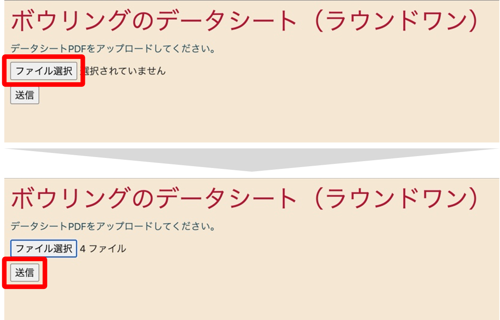
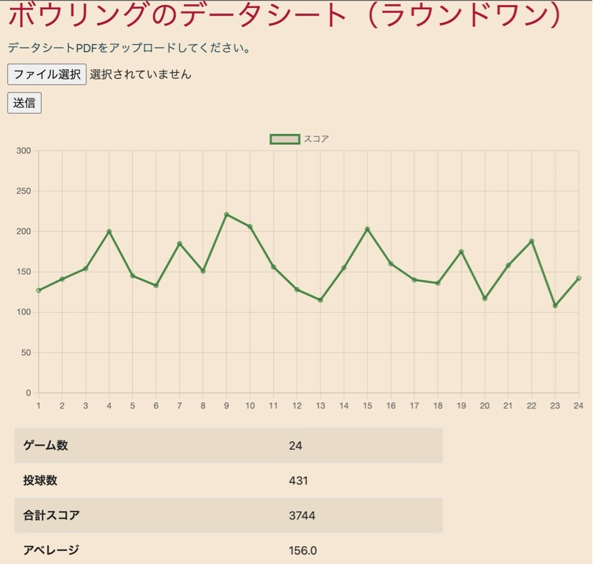

# AnalyzeBowlingDataSheetsOfRound1  

ラウンドワンのスコアシートPDFからスコアの推移を表示する。

## DEMO  

ファイル選択ボタンを押し、ラウンドワンアプリからダウンロードしたスコアシートを選択してください。

その後、各ゲームごとの合計点の推移と、簡単な指標が表示されます。

## Requirement  
Python      3.8.12  
Flask       2.0.2  
Jinja2      3.0.3  
Chart.js    3.7.0
Bootstrap   v4.2

## Reference  
[1]『Flaskを『ローカルで開発する環境構築』から『プログラムの実行まで』を一通り』https://tanuhack.com/flask-local-ade/ (Accessed on 2021-11-13).  
[2]『PyMuPDF Documentation』https://pymupdf.readthedocs.io/en/latest/ (Accessed on 2021-10-17).  
[3]『PythonでPDFから画像を抽出するもっとも簡単な方法』 https://qiita.com/41semicolon/items/111c1c3d503957afd60d (Accessed on 2021-10-17).
